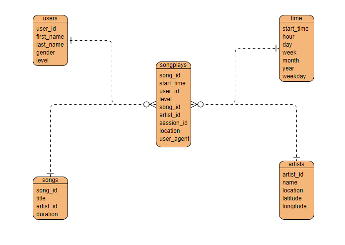
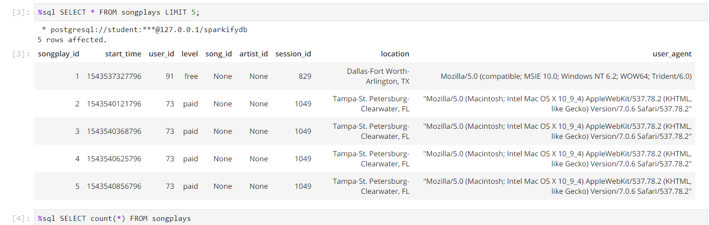
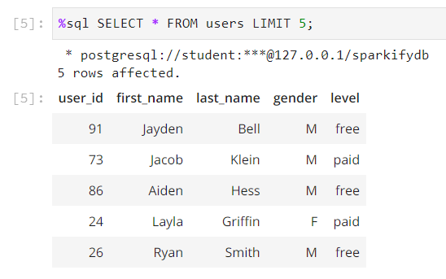
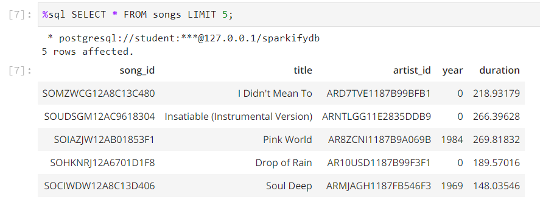
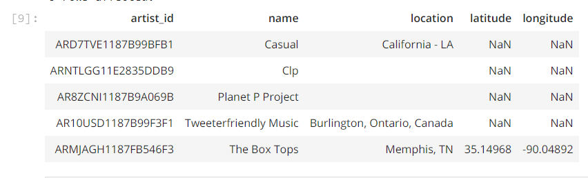
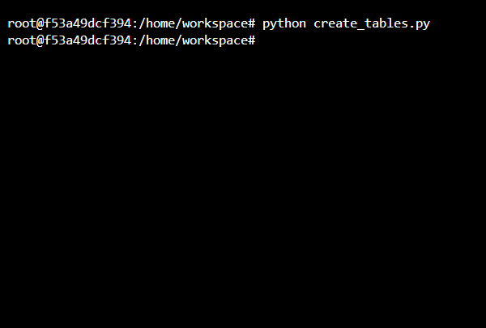

# Data Modeling with Postgres
**Project:one in Data Modeling**

### Introduction
A startup called Sparkify wants to analyze the data they've been collecting on songs and user activity on their new music streaming app. The analytics team is particularly interested in understanding what songs users are listening to. Currently, they don't have an easy way to query their data, which resides in a directory of JSON logs on user activity on the app, as well as a directory with JSON metadata on the songs in their app.

They'd like a data engineer to create a Postgres database with tables designed to optimize queries on song play analysis, and bring you on the project. Your role is to create a database schema and ETL pipeline for this analysis. You'll be able to test your database and ETL pipeline by running queries given to you by the analytics team from Sparkify and compare your results with their expected results.

### Project Description
In this project, you'll apply what you've learned on data modeling with Postgres and build an ETL pipeline using Python. To complete the project, you will need to define fact and dimension tables for a star schema for a particular analytic focus, and write an ETL pipeline that transfers data from files in two local directories into these tables in Postgres using Python and SQL.

### Data Model
**A star schema is implemented for this Data warehouse.** 

#### Fact Table

*songplays table*
The songplays_id is the PRIMARY KEY and it's "SERIAL" datatype so it's auto-incremental value.

And the required query to insert data on this table is: 

``("""
INSERT INTO songplays(start_time, user_id, level, song_id, artist_id, session_id, location, user_agent) 
VALUES (%s, %s, %s, %s, %s, %s, %s, %s)
ON CONFLICT DO NOTHING
""")``

#### Dimensional Tables
Each dimension of the fact table has been created as a table

**users table**

And the required query to insert data on this table is: 

``("""
INSERT INTO users(user_id, first_name, last_name, gender, level) 
VALUES (%s, %s, %s, %s, %s)
ON CONFLICT DO NOTHING
""")``

**songs table**

And the required query to insert data on this table is: 

``("""
INSERT INTO songs(song_id, title, artist_id, year, duration) 
    VALUES (%s, %s, %s, %s, %s)
    ON CONFLICT(song_id)
    DO NOTHING
""")``

**artists table**

And the required query to insert data on this table is: 

``("""
INSERT INTO artists(artist_id, name, location, latitude, longitude) 
    VALUES (%s, %s, %s, %s, %s)
    ON CONFLICT(artist_id)
    DO NOTHING
""")``

### .py Files
#### ETL Pipline "etl.py"
1. Database Connection 
2. song_files Processing 
    1. Inserting Songs data into "songs" table
    2. Inserting Artits data into "artists" table
3. log_files Proccessing 
    1. Inserting ts "Timestamp" in "time" table
        1. Year, Day, Hour, Week, Month, and Day of the week are all extracted from "ts" (timestamp)
    2. Inserting Users info into "user" table
    3. Inserting Songolays records into "songplays" table using the following structured query
        ``song_select = (""" 
                            SELECT songs.song_id, artists.artist_id FROM songs 
                            JOIN artists ON songs.artist_id = artists.artist_id 
                            WHERE
                            songs.title = %s AND artists.name= %s AND songs.duration= %s
                        """)``
    4. Close connection 
    
#### sql_queries.py

All the queries to the data base are in this file.

    1. Creation for all tables
    2. Inserting for all tables
    3. Select query to get artist table joined with song table to get songplays record. 
    
#### Running py. script
We can run the python script file through the terminal 
`python #filename#.py`

