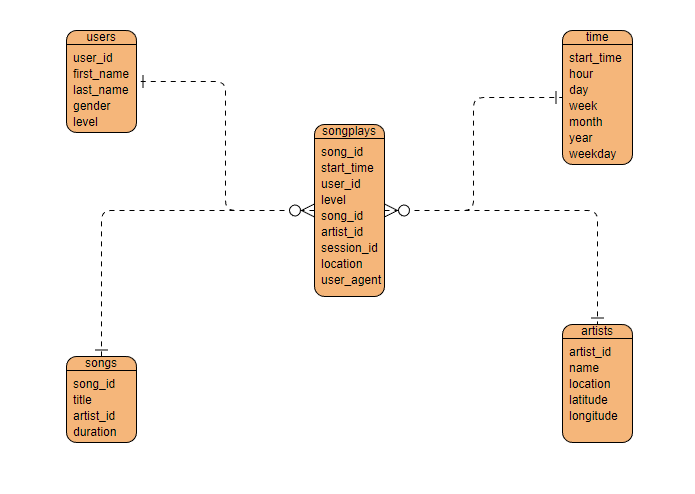

# Data Modeling with Postgres — Sparkify ETL

A star-schema PostgreSQL warehouse with a Python ETL pipeline, built around a
simulated music-streaming service (Sparkify): raw JSON activity logs and song
metadata are parsed, transformed, and loaded into fact and dimension tables
optimized for song-play analysis.

I built this during Udacity's Data Engineering Nanodegree; it remains my
cleanest small example of dimensional modeling fundamentals — schema design,
idempotent inserts, and the lookup-join pattern for resolving foreign keys
during load.

## Data model

Star schema: one fact table (`songplays`) surrounded by `users`, `songs`,
`artists`, and `time` dimensions.



**Fact — `songplays`.** `songplay_id` is a `SERIAL` primary key. Records are
resolved by joining songs and artists on title/name/duration during load:

```sql
SELECT songs.song_id, artists.artist_id
FROM songs JOIN artists ON songs.artist_id = artists.artist_id
WHERE songs.title = %s AND artists.name = %s AND songs.duration = %s
```

**Dimensions.** All inserts use `ON CONFLICT DO NOTHING` (idempotent loads —
re-running the pipeline never duplicates a user or song):

```sql
INSERT INTO users (user_id, first_name, last_name, gender, level)
VALUES (%s, %s, %s, %s, %s)
ON CONFLICT DO NOTHING
```

The `time` dimension is derived entirely from the log timestamp: hour, day,
week, month, year, weekday extracted at load time so analysts never parse
timestamps in queries.

## Files

| File | Purpose |
|---|---|
| `sql_queries.py` | All DDL + DML in one reviewable place |
| `create_tables.py` | Drops and recreates the schema (reset script) |
| `etl.py` | The pipeline: song files → dims, log files → time/users/fact |
| `etl.ipynb` | Development notebook the pipeline was built in |
| `test.ipynb` | Sanity queries against the loaded warehouse |
| `data/` | Sample JSON song and log datasets |

## Run it

```bash
python create_tables.py   # reset schema
python etl.py             # parse JSON → load star schema
```

Requires a local PostgreSQL with the `sparkifydb` role/database configured
(connection settings at the top of the scripts).

## What I'd do differently today

Working in production data engineering since building this, the upgrades I'd
make: bulk `COPY` instead of row-by-row inserts (the known bottleneck here),
constraint-first schema design (`NOT NULL` on more columns), and pytest
around the transform functions. Kept as-is because it honestly documents
where I started — my current pipeline standards are visible in my newer
repos.
